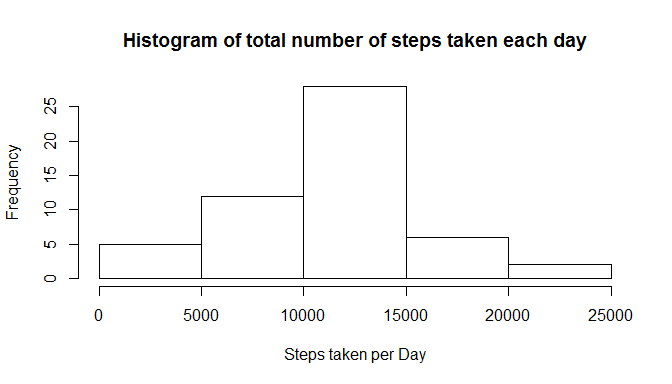

##Reproducible Research Assignment 1

**Note:** For the sake of ease of Peer Accessment, this assignment is presented in the question basic.

####Loading and preprocessing the data

Show any code that is needed to

1.Load the data (i.e. read.csv())


```r
unzip("repdata_data_activity.zip")
activity <- read.csv("activity.csv")
```

2.Process/transform the data (if necessary) into a format suitable for your analysis

**Note:** Coerce activity$date as type 'date'. NA will be handled in later part.


```r
activity$date <- as.Date(activity$date, "%Y-%m-%d")
```

####What is mean total number of steps taken per day?

For this part of the assignment, you can ignore the missing values in the dataset.

1.Make a histogram of the total number of steps taken each day


```r
dfStepsPerDay <- aggregate(steps ~ date, activity, sum)
stepsPerDay <- dfStepsPerDay$steps
hist(stepsPerDay, main="Histogram of total number of steps taken each day", xlab="Steps taken per Day")
```

 

2.Calculate and report the mean and median total number of steps taken per day


```r
mean(stepsPerDay)
```

```
## [1] 10766.19
```

```r
median(stepsPerDay)
```

```
## [1] 10765
```

####What is the average daily activity pattern?

1.Make a time series plot (i.e. type = "l") of the 5-minute interval (x-axis) and the average number of steps taken, averaged across all days (y-axis)


```r
dfAvgStepsPerInt <- aggregate(steps ~ interval, activity, mean)
avgStepsPerInt <- dfAvgStepsPerInt$steps
plot(avgStepsPerInt, type="l", main="Time series plot across all days", xlab="5-minite interval", ylab="Average number of steps taken")
```

 

2.Which 5-minute interval, on average across all the days in the dataset, contains the maximum number of steps?


```r
whichMax <- which.max(dfAvgStepsPerInt$steps)
dfAvgStepsPerInt$interval[whichMax]
```

```
## [1] 835
```

####Imputing missing values

Note that there are a number of days/intervals where there are missing values (coded as NA). The presence of missing days may introduce bias into some calculations or summaries of the data.

1.Calculate and report the total number of missing values in the dataset (i.e. the total number of rows with NAs)


```r
colSums(is.na(activity))
```

```
##    steps     date interval 
##     2304        0        0
```

2.Devise a strategy for filling in all of the missing values in the dataset. The strategy does not need to be sophisticated. For example, you could use the mean/median for that day, or the mean for that 5-minute interval, etc.

**Note:** Missing value will replaced by the mean for that 5-minute interval which has been calculated and stored in **dfAvgStepsPerInt** above

3.Create a new dataset that is equal to the original dataset but with the missing data filled in.


```r
stepsNA <- is.na(activity$steps)
activityNoNA <- activity
activityNoNA$steps[stepsNA] <- subset(dfAvgStepsPerInt, interval==activity$interval[stepsNA])$steps
```

4.Make a histogram of the total number of steps taken each day and Calculate and report the mean and median total number of steps taken per day. Do these values differ from the estimates from the first part of the assignment? What is the impact of imputing missing data on the estimates of the total daily number of steps?


```r
dfStepsPerDayNoNA <- aggregate(steps ~ date, activityNoNA, sum)
stepsPerDayNoNA <- dfStepsPerDayNoNA$steps
hist(stepsPerDayNoNA, main="Histogram of total number of steps taken each day", xlab="Steps taken per Day")
```

 

```r
mean(stepsPerDayNoNA)
```

```
## [1] 10766.19
```

```r
median(stepsPerDayNoNA)
```

```
## [1] 10765.59
```

**Note:** The impact seems to be minimal if viewing from variable Steps alone. Due to the missing value is replaced by mean, mean remains unchanged while median shows very minimal increment. However in other perspective, inputing missing data ensures record completeness which may be useful on other analysis.

####Are there differences in activity patterns between weekdays and weekends?

For this part the weekdays() function may be of some help here. Use the dataset with the filled-in missing values for this part.

1.Create a new factor variable in the dataset with two levels - "weekday" and "weekend" indicating whether a given date is a weekday or weekend day.


```r
weekday <- weekdays(activityNoNA$date)
weekend <- weekday %in% c("Saturday","Sunday")
dayType <- replace(weekend, weekend, "weekend")
dayType <- replace(dayType, weekend==F, "weekday")
activityNoNA$weekday <- factor(dayType, levels=c("weekday","weekend"))
```

2.Make a panel plot containing a time series plot (i.e. type = "l") of the 5-minute interval (x-axis) and the average number of steps taken, averaged across all weekday days or weekend days (y-axis). See the README file in the GitHub repository to see an example of what this plot should look like using simulated data.


```r
library(lattice)
dfStepsByDayTypeInt <- aggregate(steps ~ dayType + interval, activityNoNA, mean)
xyplot(steps ~ interval | dayType, dfStepsByDayTypeInt, type="l", main="Time series plot across all days", xlab="5-minite interval", ylab="Average number of steps taken")
```

 
